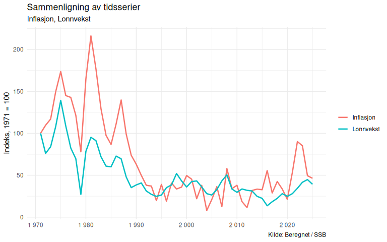
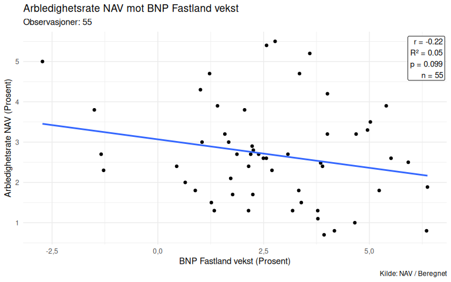
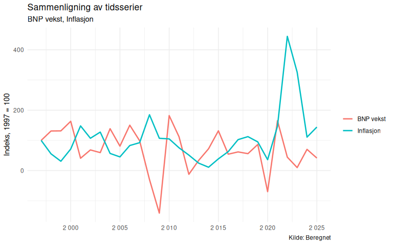
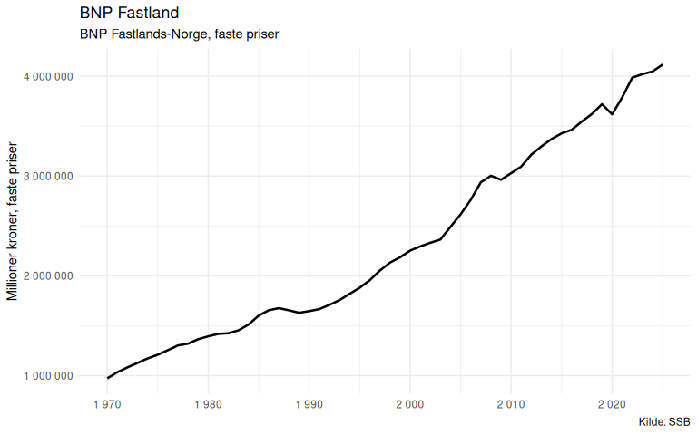

---
format:
  gfm:
    output-file: README.md
    variant: +yaml_metadata_block
execute:
  echo: true
  warning: false
  message: false
  freeze: auto
---


# NorMacro

**Version:** 2.0.0

NorMacro er et R-rammeverk for utforsking, visualisering og analyse av
norske og internasjonale makroøkonomiske tidsserier.

Pakken kombinerer kuraterte datasett, standardiserte metadata og
analysefunksjoner i ett konsistent API.

## Filosofi

- representative indikatorer fremfor flest mulig serier
- full transparens i datagrunnlag og beregninger
- metadata som dokumentasjonslag
- små funksjoner som kan kombineres til større analyser

## Status

Per juli 2026 inneholder NorMacro:

- 92 norske indikatorer (1865–2025)
- 38 internasjonale indikatorer (1960–2025)
- Full metadata for alle serier
- Innebygget kvalitetskontroll
- Visualisering og analyse

## Formål

Målet med NorMacro er å tilby et enkelt og transparent datasett for:

- undervisning i samfunnsøkonomi
- analyser av norsk økonomi
- visualiseringer og dashboards
- forskning og metodeutvikling
- tidsserieanalyser og prognoser

Alle dataserier hentes automatisk fra relevante datakilder, i all
hovedsak originalkilde.

## Hovedfunksjoner

- Automatisk nedlasting fra offentlige datakilder
- Lokal caching for raske oppslag
- Standardiserte metadata for alle variabler
- Automatisk metadata- og datavalidering
- Innebygde kvalitetskontroller
- Oversikt over datadekning (`coverage()`)
- Oversikt over ledende indikatorer (`leading_indicators()`)
- Utforsking av kategorier og metadata
- Visualisering med ggplot2 (`plot_series()`)
- Eksport til CSV, RDS og Excel

## Designprinsipper

NorMacro bygger på noen enkle prinsipper:

- én konsistent database
- én representativ tidsserie per økonomisk fenomen
- originale datakilder når det er mulig
- full dokumentasjon av alle variabler
- automatisk kvalitetssikring
- reproduserbar datainnhenting

## Installasjon

Klon prosjektet:

``` bash
git clone https://github.com/nilskvilvang/NorMacro.git
```

Åpne prosjektet i RStudio.

## Kom i gang

``` r
source("source_all.R")

install_dependencies()

overview()

normacro <- get_normacro()
```

Resultatet er et data.frame/tibble med alle tilgjengelige dataserier.

## Quick start - norske data

``` r
source("source_all.R")

normacro <- get_normacro()

plot_series("BNP_Fastland")

compare_series(
    c("BNP_Fastland", "Privat_konsum")
)

scatter_series(
    x = "BNP_Fastland_vekst",
    y = "Arbledighetsrate_NAV"
)

correlate_series(
    c(
        "Inflasjon",
        "Lonnvekst",
        "BNP_Fastland_vekst"
    )
)
```

### Compare series - eksempel: Sammenligning av inflasjon og lønnsvekst

``` r
compare_series(
  c(
    "Inflasjon",
    "Lonnvekst"
  ),
  data = normacro
)
```

<div id="fig-compare-inflation-wages">



Figure 1: BNP og arbeidsledighet.

</div>

### Scatter series - eksempel: Sammenligning av inflasjon og lønnsvekst

``` r
scatter_series(
    x = "BNP_Fastland_vekst",
    y = "Arbledighetsrate_NAV"
)
```

<div id="fig-scatter-inflation-wages">



Figure 2: Scatterplott vekst BNP fastland og arbeidsledighet.

</div>

## Quick start - internasjonale data

``` r
international <- get_international_macro()

sweden <-
    international |>
    dplyr::filter(Land == "SE")

plot_series(
    "BNP_vekst",
    data = sweden
)

compare_series(
    c("BNP_vekst", "Inflasjon"),
    data = sweden
)

scatter_series(
    x = "BNP_vekst",
    y = "Arbeidsledighetsrate",
    data = sweden
)
```

### Compare series - eksempel: BNP vekst og inflasjon i Sverige

``` r
sweden <-
    international |>
    dplyr::filter(Land == "SE")

compare_series(
    c("BNP_vekst", "Inflasjon"),
    data = sweden
)
```

<div id="fig-compare-growth-inflation-sweden">



Figure 3: BNP vekst og inflasjon i Sverige.

</div>

## NorMacro API

``` r
Data
----
get_normacro()
get_international_macro()

Metadata
--------
get_metadata()
describe_variable()
search_variables()
list_categories()
list_variables()

Utforskning
--------
overview()
coverage()

Analyse
--------
normalize_series()
compare_series()
scatter_series()
correlate_series()
variable_summary()

Visualisering
-------------
plot_series()
compare_series()
scatter_series()

Kvalitet
---------
check_normacro()
check_metadata()
validate_metadata()
```

## Utforske databasen

NorMacro inneholder metadata for alle variabler og flere
hjelpefunksjoner for å utforske innholdet.

``` r
overview()

coverage()

list_categories()

list_variables()

search_variables()

describe_variable()

leading_indicators()

category_variables()
```

## Typisk analyse

Se [docs/analyse](docs/analyse.qmd)

``` r
source("source_all.R")

normacro <- get_normacro()

overview(normacro)

describe_variable("BNP_Fastland")

plot_series("BNP_Fastland")

compare_series(
    c("BNP_Fastland", "Privat_konsum")
)

scatter_series(
    x = "BNP_Fastland_vekst",
    y = "Arbledighetsrate_NAV"
)

correlate_series(
    c(
        "Inflasjon",
        "Lonnvekst",
        "BNP_Fastland_vekst"
    )
)
```

### Describe variable - eksempel: BNP fastland

``` r
describe_variable("BNP_Fastland")
```


    Variabel:    BNP_Fastland 
    Beskrivelse: BNP Fastlands-Norge, faste priser 
    Kilde:       SSB 
    Enhet:       Millioner kroner, faste priser 
    Frekvens:    Årlig 
    Startår:     1970 
    Sluttår:     NA 
    Funksjon:    get_bnp_fastland 
    Tabell:      NRMakroHov 
    Kommentar:   Makrost = bnpb.nr23_9fn, ContentsCode = Faste 

### Plot series - eksempel: BNP fastland

``` r
plot_series("BNP_Fastland")
```

<div id="fig-BNP-fastland">



Figure 4: BNP fastland.

</div>

## Visualisering

Se [docs/visualisering](docs/visualisering.qmd).

## Konjunkturklassifisering

NorMacro inneholder en transparent indikatorbasert
konjunkturklassifisering.

``` r
business_cycle()
business_cycle_explain(2020)
```

Se [docs/business_cycle](docs/business_cycle.qmd) for metode, vekter
og poengsystem.

## Variabler

NorMacro organiserer variablene i følgende kategorier:

- Demografi
- Priser og inflasjon
- Arbeidsmarked
- Lønn og inntekt
- Husholdningsøkonomi
- Boligmarked
- Kreditt og husholdninger
- Finansmarkeder
- Offentlige finanser
- Nasjonalregnskap
- Produksjon og aktivitet
- Konjunkturindikatorer
- Utenriksøkonomi
- Energi og råvarer

For å se alle tilgjengelige variabler:

``` r
list_variables()
```

## Cache

Se [docs/cache](docs/cache.qmd).

## Metadata

NorMacro er metadata-drevet.

Se [docs/metadata](docs/metadata.qmd).

## Kvalitetskontroll

NorMacro har en enkel kvalitetskontroll som kjøres automatisk når
databasen bygges med:

``` r
normacro <- get_normacro()
```

NorMacro inneholder automatiske kvalitetskontroller og validering av
både data og metadata.

``` r
validate_metadata()

check_normacro()

testthat::test_dir("tests/testthat")
```

Funksjonen check_normacro() kontrollerer at:

- datasettet har en variabel som heter Aar
- årgangene er sortert stigende
- det ikke finnes dupliserte år
- alle variabler er dokumentert i metadata

## Eksport

Eksporter database og metadata:

``` r
normacro <- get_normacro(export = TRUE)
```

Dette oppretter:

``` text
data_clean/
├── normacro.csv
├── normacro.rds
├── metadata.csv
└── metadata.xlsx
```

## Arkitektur

Se [docs/arkitektur](docs/arkitektur.qmd).

## Reproduserbarhet

NorMacro inneholder ingen manuelt vedlikeholdte data.

Se [docs/reproduserbarhet](docs/reproduserbarhet.qmd).

## Dokumentasjon

NorMacro dokumenteres gjennom en serie korte notater i /docs:

- metadata.md
- cache.md
- reproduserbarhet.md
- arkitektur.md
- business_cycle.md
- visualisering.md
- analyse.md
- internasjonale_data.md

## Lisens

Datakildene tilhører de respektive institusjonene:

- Statistisk sentralbyrå (SSB)
- Norges Bank
- NAV
- Federal Reserve Economic Data (FRED)

NorMacro distribuerer kun kode for innhenting og bearbeiding av
offentlig tilgjengelige data.
