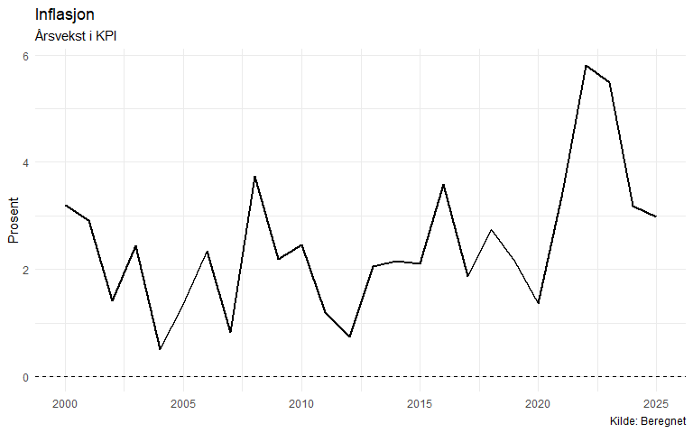
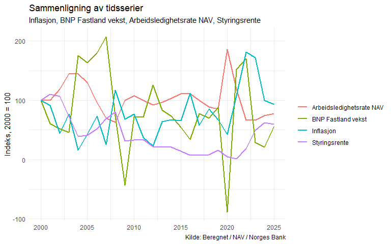
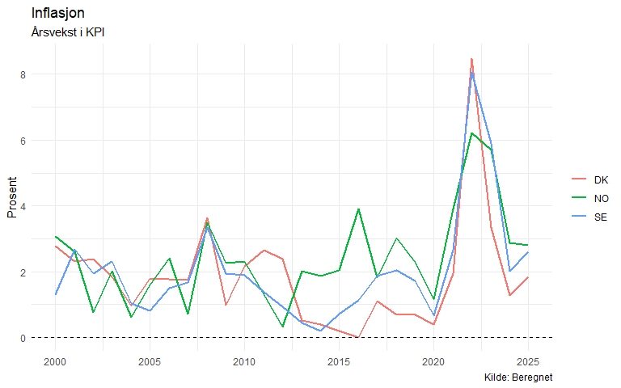
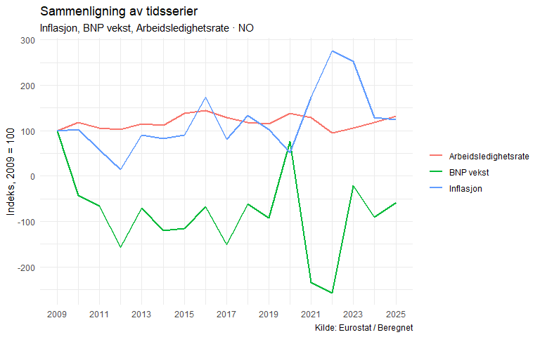
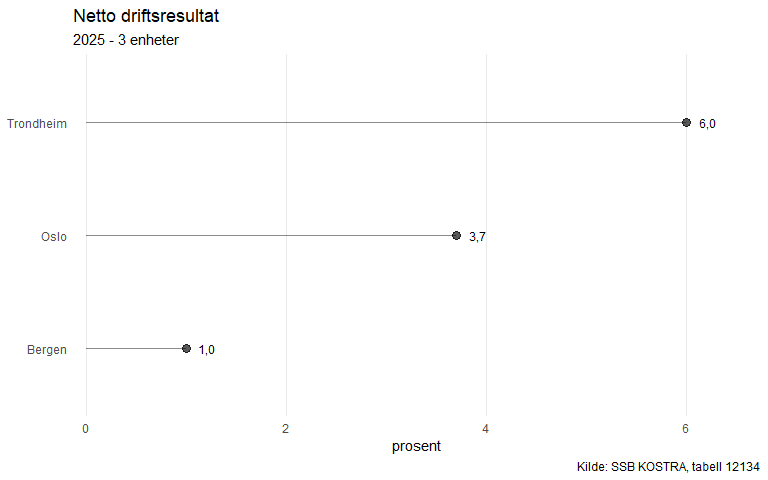

---
format:
  gfm:
    output-file: README.md
    variant: +yaml_metadata_block
execute:
  echo: true
  warning: false
  message: false
  freeze: auto
---


# NorMacro

NorMacro er en R-pakke for utforsking, visualisering og analyse av norsk
og internasjonal økonomi.

Pakken kombinerer tre datalag i ett konsistent API:

- kuraterte norske makroøkonomiske tidsserier
- internasjonale indikatorer for sammenligning mellom land
- kommunale og regionale nøkkeltall fra KOSTRA

Dataene suppleres med standardiserte metadata og funksjoner for
utforsking, sammenligning, visualisering og analyse.

## Hva inneholder NorMacro?

### Norske makrodata

NorMacro samler et kuratert utvalg norske makroøkonomiske indikatorer
fra blant annet priser, arbeidsmarked, nasjonalregnskap, boligmarked,
finansmarkeder, utenriksøkonomi og offentlige finanser.

Det fullstendige datasettet hentes med:

``` r
normacro <- get_normacro()
```

### Internasjonale data

NorMacro inneholder også standardiserte makroøkonomiske indikatorer for
Norge og utvalgte europeiske land.

``` r
international <- get_international_macro()
```

De internasjonale dataene bruker samme variabelstruktur på tvers av land
og er laget for sammenlignende analyser. Datadekningen kan variere mellom
land og variabler.

### KOSTRA

NorMacro gir standardisert tilgang til et kuratert utvalg
KOSTRA-tabeller for kommunale og regionale analyser.

KOSTRA-verktøyene støtter blant annet oversikt, metadata, rangering og
sammenligning mellom enheter.

## Installasjon

NorMacro kan installeres direkte fra GitHub:

``` r
remotes::install_github(
  "nilskvilvang/NorMacro"
)
```

Last deretter pakken:

``` r
library(NorMacro)
```

## Kom i gang

En naturlig start er å få oversikt over de norske makrodataene:

``` r
overview()
```

Finn tilgjengelige variabler:

``` r
list_variables()
```

Søk etter et økonomisk tema:

``` r
search_variables("inflasjon")
```

Undersøk en variabel nærmere:

``` r
describe_variable("Inflasjon")
```

Hent deretter datasettet dersom du vil arbeide eksplisitt med det:

``` r
normacro <- get_normacro()
```

## Analyse av norske data

README-eksemplene bruker et lite statisk datasett som følger med pakken,
slik at de kan kjøres uten eksterne API-kall.

``` r
data(normacro_example)

variable_summary(
  "Inflasjon",
  data = normacro_example
)
```


    Variabel
    --------
    Inflasjon 
    (Inflasjon)

    Beskrivelse
    -----------
    Årsvekst i KPI 

    Metadata
    --------
    Kategori: Priser og inflasjon
    Type:     Beregnet
    Kilde:    Beregnet
    Enhet:    Prosent
    Frekvens: Årlig
    Analysetype: rate

    Dekning
    -------
    2000-2025
    Observasjoner: 26

    Siste observasjon
    -----------------
    År:    2025
    Verdi: 2.986612

    Oppsummering
    ------------
    # A tibble: 1 × 8
      Display_navn Siste_aar Siste_verdi Gjennomsnitt Median Minimum Maksimum
      <chr>            <dbl>       <dbl>        <dbl>  <dbl>   <dbl>    <dbl>
    1 Inflasjon         2025        2.99         2.47   2.27   0.512     5.81
    # ℹ 1 more variable: Standardavvik <dbl>

    Sterkeste korrelasjoner
    -----------------------
    # A tibble: 5 × 3
      Display_navn             Variabel                 Korrelasjon
      <chr>                    <chr>                          <dbl>
    1 Eksport                  Eksport                        0.545
    2 KPI                      KPI                            0.518
    3 Sysselsatte              Sysselsatte                    0.491
    4 Arbeidsledighetsrate NAV Arbeidsledighetsrate_NAV      -0.485
    5 Arbeidsstyrke            Arbeidsstyrke                  0.477

### Visualiser en tidsserie

``` r
plot_series(
  "Inflasjon",
  data = normacro_example
)
```

<div id="fig-inflation">



Figure 1: Inflasjon i Norge, 2000–2025.

</div>

### Sammenlign flere serier

``` r
compare_series(
  c(
    "Inflasjon",
    "BNP_Fastland_vekst",
    "Arbeidsledighetsrate_NAV",
    "Styringsrente"
  ),
  data = normacro_example
)
```

<div id="fig-compare-series">



Figure 2: Sammenligning av utvalgte norske makroserier.

</div>

### Undersøk korrelasjoner

``` r
correlate_series(
  c(
    "Inflasjon",
    "BNP_Fastland_vekst",
    "Arbeidsledighetsrate_NAV",
    "Styringsrente"
  ),
  data = normacro_example
)
```

    # A tibble: 6 × 11
      Variabel_x               Display_x    Variabel_y Display_y Korrelasjon P_verdi
      <chr>                    <chr>        <chr>      <chr>     <chr>       <chr>  
    1 Inflasjon                Inflasjon    Arbeidsle… Arbeidsl… -0,485      0,012  
    2 BNP_Fastland_vekst       BNP Fastlan… Arbeidsle… Arbeidsl… -0,275      0,173  
    3 Arbeidsledighetsrate_NAV Arbeidsledi… Styringsr… Styrings… -0,176      0,389  
    4 Inflasjon                Inflasjon    BNP_Fastl… BNP Fast… -0,094      0,647  
    5 BNP_Fastland_vekst       BNP Fastlan… Styringsr… Styrings… 0,054       0,793  
    6 Inflasjon                Inflasjon    Styringsr… Styrings… 0,036       0,861  
    # ℹ 5 more variables: Antall_observasjoner <int>, Metode <chr>, Startaar <dbl>,
    #   Sluttaar <dbl>, Signifikant <chr>

## Internasjonale sammenligninger

Det statiske eksempeldatasettet `normacro_international_example`
inneholder data for Norge, Sverige, Danmark, Finland, Tyskland og
Frankrike.

``` r
data(normacro_international_example)
data(normacro_international_example_metadata)
```

Sammenlign inflasjonen mellom Norge, Sverige og Danmark:

``` r
plot_series(
  "Inflasjon",
  data = normacro_international_example,
  metadata = normacro_international_example_metadata,
  countries = c("NO", "SE", "DK")
)
```

<div id="fig-international-inflation">



Figure 3: Inflasjon i Norge, Sverige og Danmark.

</div>

Flere variabler kan også sammenlignes innen ett land:

``` r
compare_series(
  c(
    "Inflasjon",
    "BNP_vekst",
    "Arbeidsledighetsrate"
  ),
  data = normacro_international_example,
  country = "NO"
)
```

<div id="fig-norway-international-data">



Figure 4: Inflasjon, BNP-vekst og arbeidsledighet i Norge.

</div>

## KOSTRA

NorMacro inneholder også et statisk KOSTRA-eksempeldatasett med Oslo,
Bergen og Trondheim.

``` r
data(normacro_kostra_example)

overview_kostra_data(
  normacro_kostra_example
)
```


    KOSTRA-data
    ===========

    Tabell: 12134
    Tema:   Utvalgte nøkkeltall for kommuneregnskap

    Kommunale og regionale nøkkeltall fra KOSTRA.

    Dekning
    -------
    Periode:        2020-2025
    Observasjoner:  18
    Enheter:        3
    Variabler:      3

    Enhetstyper
    -----------
    kommune                          3

Kommunene kan for eksempel rangeres etter netto driftsresultat:

``` r
rank_kostra(
  "Netto_driftsresultat",
  data = normacro_kostra_example,
  year = 2025
)
```

    # A tibble: 3 × 6
       Rang Enhet Enhet_navn Enhetstype   Aar Verdi
      <int> <chr> <chr>      <chr>      <int> <dbl>
    1     1 5001  Trondheim  kommune     2025   6  
    2     2 0301  Oslo       kommune     2025   3.7
    3     3 4601  Bergen     kommune     2025   1  

Rangeringen kan visualiseres direkte:

``` r
plot_kostra_ranking(
  "Netto_driftsresultat",
  data = normacro_kostra_example,
  year = 2025
)
```

<div id="fig-kostra-ranking">



Figure 5: Netto driftsresultat i Oslo, Bergen og Trondheim i 2025.

</div>

## Sentrale funksjoner

Noen av de viktigste funksjonene i NorMacro er:

- `overview()` – oversikt over makrodatasettet
- `list_variables()` og `search_variables()` – finn variabler
- `describe_variable()` og `variable_summary()` – forstå og oppsummer
  serier
- `coverage()` – undersøk datadekning
- `plot_series()` – visualiser tidsserier
- `compare_series()` – sammenlign flere serier
- `correlate_series()` – beregn parvise korrelasjoner
- `growth_table()` – analyser vekst over flere perioder
- `latest_observations()` – finn siste tilgjengelige observasjoner
- `overview_kostra_data()` – oversikt over KOSTRA-data
- `rank_kostra()` og `compare_kostra_units()` – sammenlign
  KOSTRA-enheter

Se funksjonenes hjelpesider i R for full dokumentasjon.

## Dokumentasjon

NorMacro inneholder fire introduksjonsvignetter:

1.  **Kom i gang med NorMacro** – finn data, variabler og metadata
2.  **Introduksjon til NorMacro** – grunnleggende analyse og
    visualisering
3.  **Internasjonale sammenligninger med NorMacro** – analyser på tvers
    av land
4.  **KOSTRA-analyse med NorMacro** – kommunale og regionale
    sammenligninger

Vignettene kan åpnes med:

``` r
browseVignettes("NorMacro")
```

## Datakilder

NorMacro henter data fra offentlige og etablerte datakilder, blant
annet:

- Statistisk sentralbyrå (SSB)
- Norges Bank
- NAV
- Eurostat
- Federal Reserve Economic Data (FRED)

Detaljert kildeinformasjon følger de enkelte variablene i metadataene.

## Prinsipper

NorMacro bygger på noen enkle prinsipper:

- representative indikatorer fremfor flest mulig serier
- én anbefalt serie per økonomisk fenomen
- offentlige originalkilder når det er mulig
- metadata som en integrert del av databasen
- transparente beregninger
- konsistente datastrukturer
- reproduserbar datainnhenting og analyse

## Lisens

Datakildene tilhører de respektive institusjonene.

NorMacro distribuerer kode for innhenting, standardisering,
dokumentasjon og analyse av offentlig tilgjengelige data.
