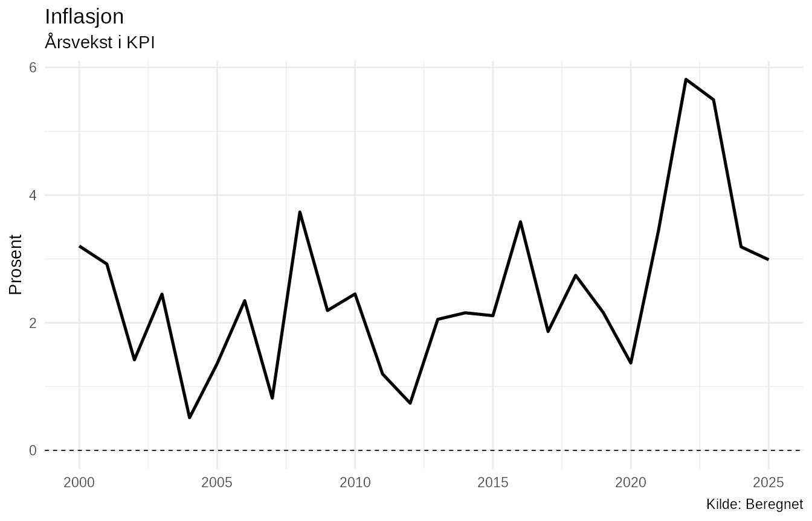
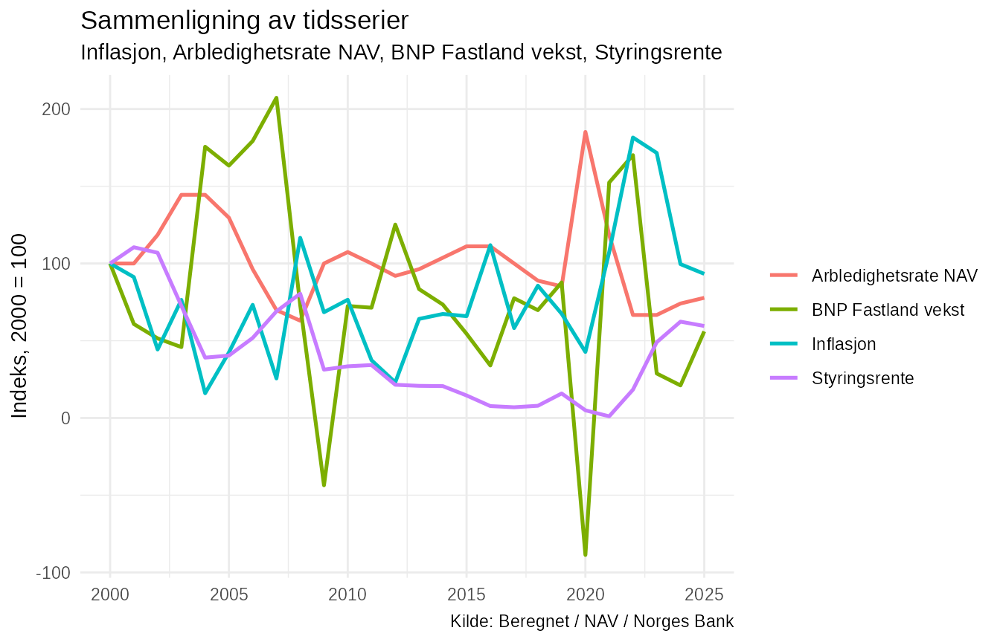

# Introduksjon til NorMacro

``` r

library(NorMacro)
```

## NorMacro

NorMacro er en R-pakke for innhenting, organisering og analyse av norske
makroøkonomiske data.

Pakken samler økonomiske tidsserier fra flere kilder i et felles format
og knytter dataene til metadata som beskriver blant annet kilde, enhet,
kategori og analysetype.

Denne vignetten viser en grunnleggende arbeidsflyt med NorMacro.
Eksemplene bruker et lite, statisk datasett som følger med pakken. Det
gjør at vignetten kan kjøres uten å hente data fra eksterne API-er.

## Eksempeldata

NorMacro inneholder eksempeldatasettet `normacro_example`. Det består av
et utvalg norske makroøkonomiske årsserier for perioden 2000–2025.

``` r

data(normacro_example)
data(normacro_example_metadata)

dim(normacro_example)
#> [1] 26 17
```

``` r

names(normacro_example)
#>  [1] "Aar"                  "KPI"                  "Inflasjon"           
#>  [4] "Befolkning"           "Arbeidsstyrke"        "Sysselsatte"         
#>  [7] "Arbledige_NAV"        "Arbledighetsrate_NAV" "Styringsrente"       
#> [10] "BNP_Fastland"         "BNP_Fastland_vekst"   "Lonnvekst"           
#> [13] "Boligprisindeks"      "Boligprisvekst"       "Oljepris_USD"        
#> [16] "Eksport"              "Import"
```

Datasettet inneholder både nivåserier, vekstrater og indekser fra flere
deler av norsk økonomi.

De tilhørende metadataene finnes i `normacro_example_metadata`.

``` r

normacro_example_metadata[
  c(
    "Variabel",
    "Display_navn",
    "Kategori",
    "Enhet",
    "Analyse_type"
  )
]
#> # A tibble: 16 × 5
#>    Variabel             Display_navn         Kategori         Enhet Analyse_type
#>    <chr>                <chr>                <chr>            <chr> <chr>       
#>  1 KPI                  KPI                  Priser og infla… 2025… indeks      
#>  2 Inflasjon            Inflasjon            Priser og infla… Pros… rate        
#>  3 Befolkning           Befolkning           Demografi        Pers… nivå        
#>  4 Arbeidsstyrke        Arbeidsstyrke        Arbeidsmarked    Pers… nivå        
#>  5 Sysselsatte          Sysselsatte          Arbeidsmarked    Pers… nivå        
#>  6 Arbledige_NAV        Arbledige NAV        Arbeidsmarked    Pers… nivå        
#>  7 Arbledighetsrate_NAV Arbledighetsrate NAV Arbeidsmarked    Pros… rate        
#>  8 Styringsrente        Styringsrente        Finansmarkeder   Pros… rate        
#>  9 BNP_Fastland         BNP Fastland         Nasjonalregnskap Mill… nivå        
#> 10 BNP_Fastland_vekst   BNP Fastland vekst   Nasjonalregnskap Pros… rate        
#> 11 Lonnvekst            Lonnvekst            Lønn og inntekt  Pros… rate        
#> 12 Boligprisindeks      Boligprisindeks      Boligmarked      Inde… indeks      
#> 13 Boligprisvekst       Boligprisvekst       Boligmarked      Pros… rate        
#> 14 Oljepris_USD         Oljepris USD         Energi og råvar… USD … nivå        
#> 15 Eksport              Eksport              Utenriksøkonomi  Mill… nivå        
#> 16 Import               Import               Utenriksøkonomi  Mill… nivå
```

## Datadekning

[`coverage()`](https://nilskvilvang.github.io/NorMacro/reference/coverage.md)
gir en samlet oversikt over hvilke perioder variablene dekker, antall
observasjoner og eventuell manglende data.

``` r

coverage(normacro_example)
#> # A tibble: 16 × 11
#>    Variabel      Startaar_data Sluttaar_data Antall_observasjoner Antall_mangler
#>    <chr>                 <dbl>         <dbl>                <int>          <int>
#>  1 Arbeidsstyrke          2000          2025                   26              0
#>  2 Arbledige_NAV          2000          2025                   26              0
#>  3 Arbledighets…          2000          2025                   26              0
#>  4 Sysselsatte            2000          2025                   26              0
#>  5 Boligprisind…          2000          2025                   26              0
#>  6 Boligprisvek…          2000          2025                   26              0
#>  7 Befolkning             2000          2025                   26              0
#>  8 Oljepris_USD           2000          2025                   26              0
#>  9 Styringsrente          2000          2025                   26              0
#> 10 Lonnvekst              2000          2025                   26              0
#> 11 BNP_Fastland           2000          2025                   26              0
#> 12 BNP_Fastland…          2000          2025                   26              0
#> 13 Inflasjon              2000          2025                   26              0
#> 14 KPI                    2000          2025                   26              0
#> 15 Eksport                2000          2025                   26              0
#> 16 Import                 2000          2025                   26              0
#> # ℹ 6 more variables: Display_navn <chr>, Kategori <chr>, Type <chr>,
#> #   Beskrivelse <chr>, Enhet <chr>, Analyse_type <chr>
```

For eksempeldatasettet har alle seriene observasjoner for hele perioden
2000–2025.

Med det fullstendige NorMacro-datasettet vil startår og datadekning
variere mellom seriene.

## Undersøk én variabel

[`variable_summary()`](https://nilskvilvang.github.io/NorMacro/reference/variable_summary.md)
samler sentral informasjon om én variabel.

Her undersøker vi norsk inflasjon:

``` r

variable_summary(
  "Inflasjon",
  data = normacro_example
)
#> 
#> Variabel
#> --------
#> Inflasjon 
#> (Inflasjon)
#> 
#> Beskrivelse
#> -----------
#> Årsvekst i KPI 
#> 
#> Metadata
#> --------
#> Kategori: Priser og inflasjon
#> Type:     Beregnet
#> Kilde:    Beregnet
#> Enhet:    Prosent
#> Frekvens: Årlig
#> Analysetype: rate
#> 
#> Dekning
#> -------
#> 2000-2025
#> Observasjoner: 26
#> 
#> Siste observasjon
#> -----------------
#> År:    2025
#> Verdi: 2.986612
#> 
#> Oppsummering
#> ------------
#> # A tibble: 1 × 8
#>   Display_navn Siste_aar Siste_verdi Gjennomsnitt Median Minimum Maksimum
#>   <chr>            <dbl>       <dbl>        <dbl>  <dbl>   <dbl>    <dbl>
#> 1 Inflasjon         2025        2.99         2.47   2.27   0.512     5.81
#> # ℹ 1 more variable: Standardavvik <dbl>
#> 
#> Sterkeste korrelasjoner
#> -----------------------
#> # A tibble: 5 × 3
#>   Display_navn         Variabel             Korrelasjon
#>   <chr>                <chr>                      <dbl>
#> 1 Eksport              Eksport                    0.545
#> 2 KPI                  KPI                        0.518
#> 3 Arbledighetsrate NAV Arbledighetsrate_NAV      -0.485
#> 4 Arbeidsstyrke        Arbeidsstyrke              0.477
#> 5 Boligprisindeks      Boligprisindeks            0.476
```

Resultatet kombinerer metadata og dataanalyse. Det viser blant annet
beskrivelse, kilde, måleenhet, datadekning, siste observasjon,
deskriptiv statistikk og de sterkeste korrelasjonene med andre variabler
i datasettet.

## Plotting av en tidsserie

[`plot_series()`](https://nilskvilvang.github.io/NorMacro/reference/plot_series.md)
lager en tidsseriefigur med informasjon fra NorMacro-metadataene brukt
til blant annet tittel og aksemerking.

``` r

plot_series(
  "Inflasjon",
  data = normacro_example
)
```



Figuren viser hvordan inflasjonen har variert gjennom perioden.

## Sammenlign flere serier

Makroøkonomiske variabler har ofte forskjellige måleenheter og
størrelsesnivåer.
[`compare_series()`](https://nilskvilvang.github.io/NorMacro/reference/compare_series.md)
kan derfor normalisere serier slik at utviklingen kan sammenlignes på en
felles skala.

``` r

compare_series(
  c(
    "Inflasjon",
    "Arbledighetsrate_NAV",
    "BNP_Fastland_vekst",
    "Styringsrente"
  ),
  data = normacro_example
)
```



Standardinnstillingen er `normalize = TRUE`. Det gjør figuren egnet til
å sammenligne utviklingsmønstre selv om de opprinnelige seriene måles på
ulike skalaer.

## Korrelasjon mellom variabler

[`correlate_series()`](https://nilskvilvang.github.io/NorMacro/reference/correlate_series.md)
beregner parvise korrelasjoner mellom valgte tidsserier.

``` r

correlate_series(
  c(
    "Inflasjon",
    "Arbledighetsrate_NAV",
    "BNP_Fastland_vekst",
    "Styringsrente"
  ),
  data = normacro_example
)
#> # A tibble: 6 × 11
#>   Variabel_x           Display_x        Variabel_y Display_y Korrelasjon P_verdi
#>   <chr>                <chr>            <chr>      <chr>     <chr>       <chr>  
#> 1 Inflasjon            Inflasjon        Arbledigh… Arbledig… -0,485      0,012  
#> 2 Arbledighetsrate_NAV Arbledighetsrat… BNP_Fastl… BNP Fast… -0,275      0,173  
#> 3 Arbledighetsrate_NAV Arbledighetsrat… Styringsr… Styrings… -0,176      0,389  
#> 4 Inflasjon            Inflasjon        BNP_Fastl… BNP Fast… -0,094      0,647  
#> 5 BNP_Fastland_vekst   BNP Fastland ve… Styringsr… Styrings… 0,054       0,793  
#> 6 Inflasjon            Inflasjon        Styringsr… Styrings… 0,036       0,861  
#> # ℹ 5 more variables: Antall_observasjoner <int>, Metode <chr>, Startaar <dbl>,
#> #   Sluttaar <dbl>, Signifikant <chr>
```

Tabellen viser korrelasjonskoeffisient, p-verdi, antall observasjoner og
perioden som inngår i beregningen.

Korrelasjon beskriver statistisk samvariasjon mellom serier. Den
innebærer ikke i seg selv en kausal sammenheng.

## Vekst over flere perioder

For nivåserier kan
[`growth_table()`](https://nilskvilvang.github.io/NorMacro/reference/growth_table.md)
brukes til å sammenligne utviklingen over flere tidshorisonter.

``` r

growth_table(
  c(
    "Befolkning",
    "Arbeidsstyrke",
    "Sysselsatte"
  ),
  data = normacro_example
)
#> # A tibble: 3 × 9
#>   Display_navn  Siste_aar Siste_verdi Vekst_1aar CAGR_1aar Vekst_5aar CAGR_5aar
#>   <chr>             <dbl>       <dbl>      <dbl>     <dbl>      <dbl>     <dbl>
#> 1 Befolkning         2025     5594340      0.795     0.795       4.22     0.831
#> 2 Arbeidsstyrke      2025     3039000      0.997     0.997       6.97     1.36 
#> 3 Sysselsatte        2025     2903000      0.485     0.485       7.12     1.39 
#> # ℹ 2 more variables: Vekst_10aar <dbl>, CAGR_10aar <dbl>
```

Tabellen viser siste observasjon samt samlet vekst og gjennomsnittlig
årlig vekst (CAGR) over ett, fem og ti år.

## Siste tilgjengelige observasjoner

[`latest_observations()`](https://nilskvilvang.github.io/NorMacro/reference/latest_observations.md)
gir en kompakt oversikt over den siste observasjonen for hver variabel.

``` r

latest_observations(
  data = normacro_example
)
#> # A tibble: 16 × 10
#>    Siste_aar Variabel  Siste_verdi Display_navn Kategori Type  Beskrivelse Enhet
#>        <dbl> <chr>           <dbl> <chr>        <chr>    <chr> <chr>       <chr>
#>  1      2025 Arbeidss…  3039000    Arbeidsstyr… Arbeids… Orig… Personer i… Pers…
#>  2      2025 Arbledig…    63036    Arbledige N… Arbeids… Orig… Registrert… Pers…
#>  3      2025 Arbledig…        2.1  Arbledighet… Arbeids… Orig… Registrert… Pros…
#>  4      2025 Sysselsa…  2903000    Sysselsatte  Arbeids… Orig… Sysselsatt… Pers…
#>  5      2025 Boligpri…      152.   Boligprisin… Boligma… Orig… Prisindeks… Inde…
#>  6      2025 Boligpri…        5.46 Boligprisve… Boligma… Bere… Årlig pros… Pros…
#>  7      2025 Befolkni…  5594340    Befolkning   Demogra… Orig… Befolkning… Pers…
#>  8      2025 Oljepris…       69.1  Oljepris USD Energi … Orig… Brent Blen… USD …
#>  9      2025 Styrings…        4.30 Styringsren… Finansm… Orig… Norges Ban… Pros…
#> 10      2025 Lonnvekst        4.9  Lonnvekst    Lønn og… Orig… Årslønn, p… Pros…
#> 11      2025 BNP_Fast…  4117384    BNP Fastland Nasjona… Orig… BNP Fastla… Mill…
#> 12      2025 BNP_Fast…        1.72 BNP Fastlan… Nasjona… Bere… Årsvekst i… Pros…
#> 13      2025 Inflasjon        2.99 Inflasjon    Priser … Bere… Årsvekst i… Pros…
#> 14      2025 KPI            100    KPI          Priser … Orig… Konsumpris… 2025…
#> 15      2025 Eksport    2673535    Eksport      Utenrik… Orig… Eksport i … Mill…
#> 16      2025 Import     1770968    Import       Utenrik… Orig… Import i a… Mill…
#> # ℹ 2 more variables: Kilde <chr>, Analyse_type <chr>
```

Resultatet kombinerer siste verdi med sentrale metadata, blant annet
kategori, beskrivelse, enhet, kilde og analysetype.

## Arbeid med det fullstendige datasettet

Eksempeldatasettet er laget for dokumentasjon og reproducerbare
eksempler. Ved vanlig bruk kan det fullstendige norske makrodatasettet
hentes med
[`get_normacro()`](https://nilskvilvang.github.io/NorMacro/reference/get_normacro.md):

``` r

macro <- get_normacro()
```

Funksjonene i denne vignetten kan deretter brukes på samme måte:

``` r

coverage(macro)

variable_summary(
  "Inflasjon",
  data = macro
)

plot_series(
  "Inflasjon",
  data = macro
)
```

Det fullstendige datasettet inneholder flere variabler og lengre
historiske tidsserier enn eksempeldatasettet.

NorMacro inneholder også funksjonalitet for internasjonale
sammenligninger, konjunkturanalyse og norske kommune- og fylkesdata fra
KOSTRA. Disse delene behandles separat fra den grunnleggende
arbeidsflyten som er vist her.
