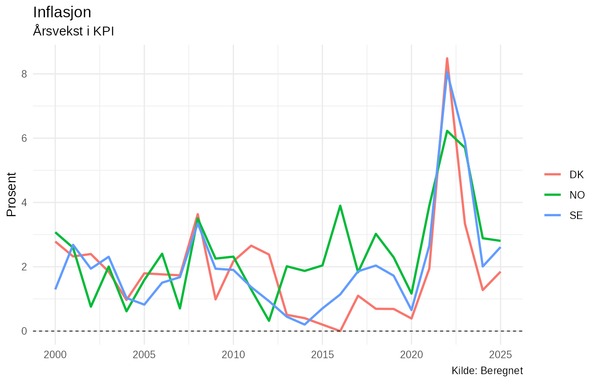
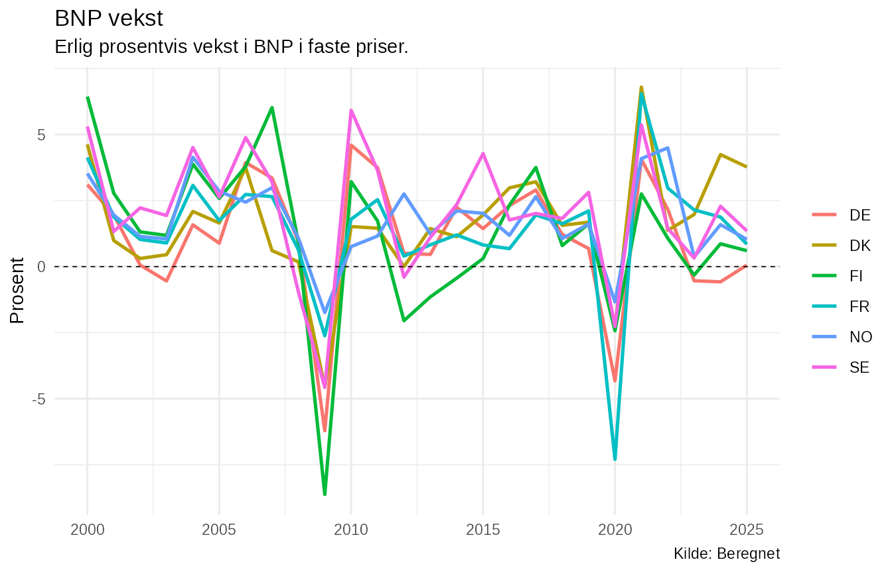
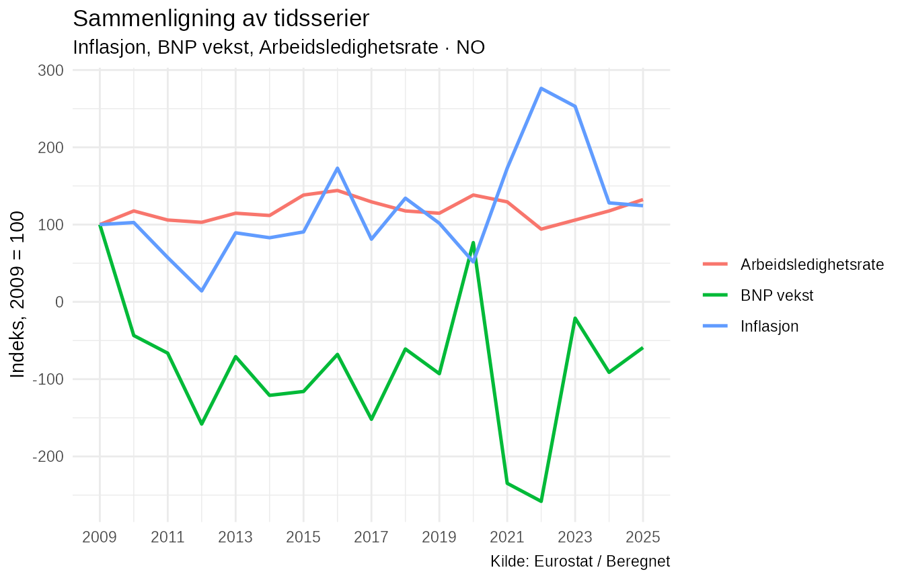

# Internasjonale sammenligninger med NorMacro

``` r

library(NorMacro)
```

## Internasjonale data i NorMacro

NorMacro inneholder standardiserte makroøkonomiske data som kan brukes
til å sammenligne Norge med andre europeiske land.

De internasjonale dataene følger samme grunnprinsipp som de norske
dataene, men inneholder i tillegg kolonnen `Land`. Hver rad
representerer derfor en kombinasjon av land og år.

Denne vignetten bruker et statisk eksempeldatasett som følger med
pakken. Det gjør eksemplene reproducerbare og uavhengige av eksterne
API-er.

## Eksempeldatasettet

``` r

data(normacro_international_example)
data(normacro_international_example_metadata)

dim(normacro_international_example)
#> [1] 156  14
```

Eksempeldatasettet inneholder årlige observasjoner for perioden
2000–2025 for Norge, Sverige, Danmark, Finland, Tyskland og Frankrike.

``` r

sort(unique(normacro_international_example$Land))
#> [1] "DE" "DK" "FI" "FR" "NO" "SE"
```

De økonomiske variablene omfatter blant annet priser, arbeidsmarked,
nasjonalregnskap, boligmarked og utenriksøkonomi.

``` r

names(normacro_international_example)
#>  [1] "Aar"                  "Land"                 "HICP"                
#>  [4] "Inflasjon"            "Befolkning"           "Arbeidsledighetsrate"
#>  [7] "BNP_faste_priser"     "BNP_vekst"            "Sysselsatte"         
#> [10] "Arbeidsstyrke"        "Boligprisindeks"      "Boligprisvekst"      
#> [13] "Eksport"              "Import"
```

Metadataene beskriver variablene og deres enheter:

``` r

normacro_international_example_metadata[
  c(
    "Variabel",
    "Display_navn",
    "Kategori",
    "Enhet",
    "Analyse_type"
  )
]
#> # A tibble: 12 × 5
#>    Variabel             Display_navn                 Kategori Enhet Analyse_type
#>    <chr>                <chr>                        <chr>    <chr> <chr>       
#>  1 HICP                 Harmonisert konsumprisindeks Priser … Inde… indeks      
#>  2 Inflasjon            Inflasjon                    Priser … Pros… rate        
#>  3 Befolkning           Befolkning                   Demogra… Pers… nivå        
#>  4 Arbeidsledighetsrate Arbeidsledighetsrate         Arbeids… Pros… rate        
#>  5 BNP_faste_priser     BNP faste priser             Nasjona… Mill… nivå        
#>  6 BNP_vekst            BNP vekst                    Nasjona… Pros… rate        
#>  7 Sysselsatte          Sysselsatte                  Arbeids… Pers… nivå        
#>  8 Arbeidsstyrke        Arbeidsstyrke                Arbeids… Pers… nivå        
#>  9 Boligprisindeks      Boligprisindeks              Boligma… Inde… indeks      
#> 10 Boligprisvekst       Boligprisvekst               Boligma… Pros… rate        
#> 11 Eksport              Eksport                      Utenrik… Mill… nivå        
#> 12 Import               Import                       Utenrik… Mill… nivå
```

## Sammenlign én variabel mellom land

[`plot_series()`](https://nilskvilvang.github.io/NorMacro/reference/plot_series.md)
kan brukes til å plotte samme variabel for flere land.

Her sammenlignes inflasjonen i Norge, Sverige og Danmark:

``` r

plot_series(
  "Inflasjon",
  data = normacro_international_example,
  metadata = normacro_international_example_metadata,
  countries = c("NO", "SE", "DK")
)
```



Når `data` inneholder kolonnen `Land`, tegnes én tidsserie per land.

Det gjør det mulig å se både felles økonomiske bevegelser og perioder
der utviklingen skiller seg mellom landene.

## Sammenlign alle eksempel-landene

Det samme kan gjøres for alle landene i datasettet.

``` r

plot_series(
  "BNP_vekst",
  data = normacro_international_example,
  metadata = normacro_international_example_metadata
)
```



Her viser figuren årlig vekst i BNP i faste priser.

Makroøkonomiske sjokk kan påvirke flere land samtidig, men både
størrelse og tidsforløp kan variere mellom økonomiene.

## Sammenlign flere variabler innen ett land

Internasjonale data kan også brukes til å studere samspillet mellom
flere økonomiske størrelser innen ett bestemt land.

[`compare_series()`](https://nilskvilvang.github.io/NorMacro/reference/compare_series.md)
har argumentet `country`, som velger landet som skal analyseres.

``` r

compare_series(
  c(
    "Inflasjon",
    "BNP_vekst",
    "Arbeidsledighetsrate"
  ),
  data = normacro_international_example,
  country = "NO"
)
```



Som standard normaliseres seriene. Det gjør det lettere å sammenligne
utviklingen når variablene har forskjellige måleenheter og nivåer.

## Korrelasjoner innen ett land

[`correlate_series()`](https://nilskvilvang.github.io/NorMacro/reference/correlate_series.md)
kan brukes etter at datasettet er filtrert til ett land.

``` r

norway <- normacro_international_example[
  normacro_international_example$Land == "NO",
]

correlate_series(
  c(
    "Inflasjon",
    "BNP_vekst",
    "Arbeidsledighetsrate",
    "Boligprisvekst"
  ),
  data = norway
)
#> # A tibble: 6 × 11
#>   Variabel_x           Display_x        Variabel_y Display_y Korrelasjon P_verdi
#>   <chr>                <chr>            <chr>      <chr>     <chr>       <chr>  
#> 1 BNP_vekst            BNP vekst        Boligpris… Boligpri… 0,450       0,047  
#> 2 Arbeidsledighetsrate Arbeidsledighet… Boligpris… Boligpri… 0,356       0,161  
#> 3 Inflasjon            Inflasjon        Boligpris… Boligpri… -0,284      0,225  
#> 4 Inflasjon            Inflasjon        Arbeidsle… Arbeidsl… -0,164      0,530  
#> 5 BNP_vekst            BNP vekst        Arbeidsle… Arbeidsl… -0,097      0,711  
#> 6 Inflasjon            Inflasjon        BNP_vekst  BNP vekst 0,089       0,665  
#> # ℹ 5 more variables: Antall_observasjoner <int>, Metode <chr>, Startaar <int>,
#> #   Sluttaar <int>, Signifikant <chr>
```

NorMacro bruker tilgjengelige felles observasjoner for hvert
variabelpar. Analyseperioden kan derfor variere mellom korrelasjonene
når tidsseriene har forskjellig datadekning.

Korrelasjoner beskriver statistisk samvariasjon og innebærer ikke i seg
selv en kausal sammenheng.

## Siste observasjoner på tvers av land

[`latest_observations()`](https://nilskvilvang.github.io/NorMacro/reference/latest_observations.md)
gjenkjenner den internasjonale datastrukturen og finner siste
tilgjengelige observasjon for hver kombinasjon av land og variabel.

``` r

latest_observations(
  data = normacro_international_example
)
#> # A tibble: 72 × 11
#>    Siste_aar Land  Variabel  Siste_verdi Display_navn Kategori Type  Beskrivelse
#>        <int> <chr> <chr>           <dbl> <chr>        <chr>    <chr> <chr>      
#>  1      2025 DE    Arbeidsl…     3.8 e+0 Arbeidsledi… Arbeids… Orig… Arbeidsled…
#>  2      2025 DE    Arbeidss…     4.23e+7 Arbeidsstyr… Arbeids… Orig… Personer i…
#>  3      2025 DE    Sysselsa…     4.60e+7 Sysselsatte  Arbeids… Orig… Sysselsatt…
#>  4      2025 DE    Boligpri…     1.53e+2 Boligprisin… Boligma… Orig… Prisindeks…
#>  5      2025 DE    Boligpri…     3.18e+0 Boligprisve… Boligma… Bere… Årlig pros…
#>  6      2025 DE    Befolkni…     8.36e+7 Befolkning   Demogra… Orig… Befolkning…
#>  7      2025 DE    BNP_fast…     3.26e+6 BNP faste p… Nasjona… Orig… Bruttonasj…
#>  8      2025 DE    BNP_vekst     5.71e-2 BNP vekst    Nasjona… Bere… Erlig pros…
#>  9      2025 DE    HICP          1.32e+2 Harmonisert… Priser … Orig… Harmoniser…
#> 10      2025 DE    Inflasjon     2.25e+0 Inflasjon    Priser … Bere… Årsvekst i…
#> # ℹ 62 more rows
#> # ℹ 3 more variables: Enhet <chr>, Kilde <chr>, Analyse_type <chr>
```

Resultatet inkluderer både land, verdi og sentrale metadata.

Det kan for eksempel filtreres videre med vanlige R-verktøy dersom bare
enkelte land eller kategorier er interessante.

## Hent det fullstendige internasjonale datasettet

Det statiske eksempeldatasettet brukes i denne vignetten for å gjøre
dokumentasjonen reproducerbar.

Ved vanlig bruk hentes det fullstendige internasjonale datasettet med:

``` r

international <- get_international_macro()
```

De samme analysefunksjonene kan deretter brukes på det fullstendige
datasettet.

``` r

plot_series(
  "Inflasjon",
  data = international,
  countries = c("NO", "SE", "DK", "DE")
)

compare_series(
  c(
    "Inflasjon",
    "BNP_vekst",
    "Arbeidsledighetsrate"
  ),
  data = international,
  country = "NO"
)
```

[`get_international_macro()`](https://nilskvilvang.github.io/NorMacro/reference/get_international_macro.md)
kan hente eller bygge data fra NorMacros internasjonale datakilder.
Derfor kjøres ikke denne datainnhentingen som en del av selve
vignettbyggingen.

## Videre analyse

Internasjonale data gjør det mulig å bruke NorMacro både til å analysere
utviklingen i ett land og til å sette norsk økonomi inn i en bredere
europeisk sammenheng.

Mer avanserte analyser kan bygge videre på de samme standardiserte
variablene, blant annet gjennom normalisering, korrelasjonsanalyse,
regresjon og konjunkturanalyse.
