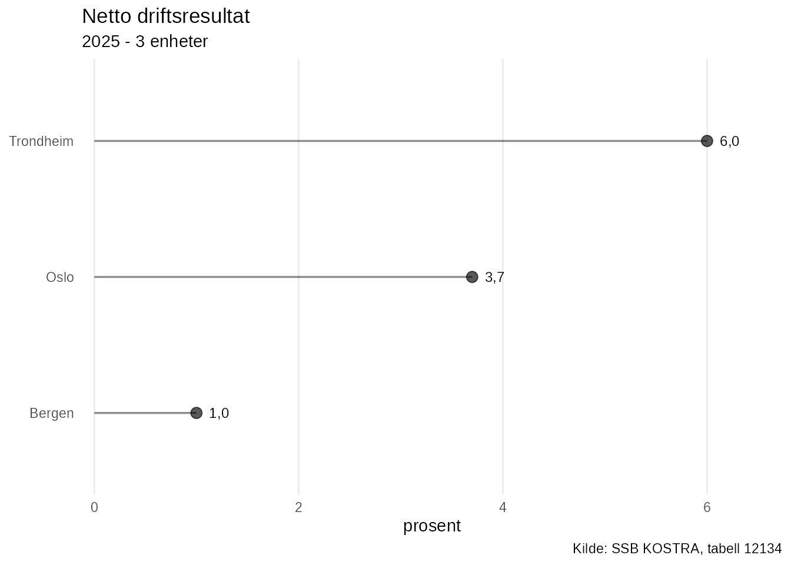
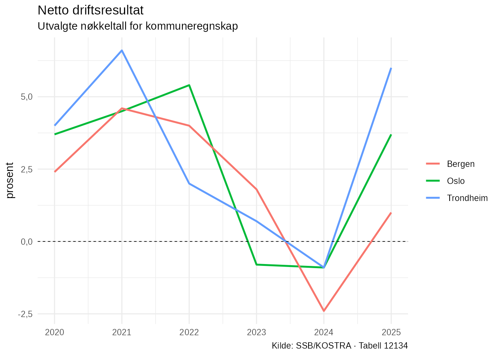

# KOSTRA-analyse med NorMacro

``` r

library(NorMacro)
```

NorMacro inneholder verktøy for å arbeide med kommunale og regionale
data fra KOSTRA.

KOSTRA-data skiller seg fra de vanlige makroøkonomiske tidsseriene ved
at datasettet inneholder observasjoner for flere geografiske enheter.
Dette gjør det mulig å sammenligne kommuner, undersøke utviklingen over
tid og vurdere en kommune mot andre kommuner.

Denne vignetten viser en grunnleggende arbeidsflyt:

1.  undersøk KOSTRA-datasettet
2.  se hvilke indikatorer datasettet inneholder
3.  oppsummer en indikator
4.  ranger kommuner
5.  sammenlign utviklingen mellom kommuner
6.  visualiser resultatene

## Eksempeldata

For å gjøre eksemplene reproduserbare bruker vi det statiske
eksempeldatasettet `normacro_kostra_example`.

``` r

data(normacro_kostra_example)

normacro_kostra_example
#> # A tibble: 18 × 7
#>    Enhet Enhet_navn Enhetstype   Aar Netto_driftsresultat Langsiktig_gjeld_ute…¹
#>    <chr> <chr>      <chr>      <int>                <dbl>                  <dbl>
#>  1 0301  Oslo       kommune     2020                  3.7                   83.4
#>  2 0301  Oslo       kommune     2021                  4.5                   82  
#>  3 0301  Oslo       kommune     2022                  5.4                   86.5
#>  4 0301  Oslo       kommune     2023                 -0.8                   93.8
#>  5 0301  Oslo       kommune     2024                 -0.9                  107. 
#>  6 0301  Oslo       kommune     2025                  3.7                  111. 
#>  7 4601  Bergen     kommune     2020                  2.4                   91  
#>  8 4601  Bergen     kommune     2021                  4.6                   94  
#>  9 4601  Bergen     kommune     2022                  4                     96  
#> 10 4601  Bergen     kommune     2023                  1.8                  101  
#> 11 4601  Bergen     kommune     2024                 -2.4                  108  
#> 12 4601  Bergen     kommune     2025                  1                    101. 
#> 13 5001  Trondheim  kommune     2020                  4                     95  
#> 14 5001  Trondheim  kommune     2021                  6.6                   98  
#> 15 5001  Trondheim  kommune     2022                  2                    100  
#> 16 5001  Trondheim  kommune     2023                  0.7                  105  
#> 17 5001  Trondheim  kommune     2024                 -0.9                  112  
#> 18 5001  Trondheim  kommune     2025                  6                    114. 
#> # ℹ abbreviated name: ¹​Langsiktig_gjeld_uten_pensjonsforpliktelser
#> # ℹ 1 more variable: Frie_inntekter_per_innbygger <dbl>
```

Datasettet inneholder utvalgte nøkkeltall for Oslo, Bergen og Trondheim
for perioden 2020–2025.

Et KOSTRA-datasett i NorMacro har noen faste identifikasjonskolonner:

- `Enhet` er enhetens kode
- `Enhet_navn` er navnet på kommunen eller den regionale enheten
- `Enhetstype` angir hvilken type enhet observasjonen gjelder
- `Aar` angir observasjonsåret

De øvrige kolonnene er KOSTRA-indikatorer.

## Få oversikt over datasettet

En naturlig start er:

``` r

overview_kostra_data(normacro_kostra_example)
#> 
#> KOSTRA-data
#> ===========
#> 
#> Tabell: 12134
#> Tema:   Utvalgte nøkkeltall for kommuneregnskap
#> 
#> Kommunale og regionale nøkkeltall fra KOSTRA.
#> 
#> Dekning
#> -------
#> Periode:        2020-2025
#> Observasjoner:  18
#> Enheter:        3
#> Variabler:      3
#> 
#> Enhetstyper
#> -----------
#> kommune                          3
```

[`overview_kostra_data()`](https://nilskvilvang.github.io/NorMacro/reference/overview_kostra_data.md)
viser blant annet hvilken KOSTRA-tabell datasettet kommer fra, hvilken
periode det dekker, hvor mange enheter det inneholder og hvor mange
indikatorer som er tilgjengelige.

NorMacro lagrer informasjon om KOSTRA-tabellen som attributter på
datasettet. Det gjør at flere funksjoner kan identifisere tabellen
automatisk.

## Metadata og indikatorer

Metadata for KOSTRA-tabellen kan hentes direkte fra datasettet:

``` r

kostra_metadata <- get_kostra_metadata(
  data = normacro_kostra_example
)

kostra_metadata
#> # A tibble: 9 × 5
#>   ContentsCode Variabel                          Display_navn Enhet Analyse_type
#>   <chr>        <chr>                             <chr>        <chr> <chr>       
#> 1 KOSAGD230000 Netto_driftsresultat              Netto drift… pros… rate        
#> 2 KOSAGD290000 Merforbruk_driftsregnskap         Årets merfo… pros… rate        
#> 3 KOSKG280000  Arbeidskapital_uten_premieavvik   Arbeidskapi… pros… rate        
#> 4 KOSKG400000  Netto_renteeksponering            Netto rente… pros… rate        
#> 5 KOSKG320000  Langsiktig_gjeld_uten_pensjonsfo… Langsiktig … pros… rate        
#> 6 KOSAG110000  Frie_inntekter_per_innbygger      Frie inntek… kr    nivå        
#> 7 KOSKG210000  Fri_egenkapital_drift             Fri egenkap… pros… rate        
#> 8 KOSAGI10000  Brutto_investeringsutgifter       Brutto inve… pros… rate        
#> 9 KOSAGI210000 Egenfinansiering_investeringer    Egenfinansi… pros… rate
```

Metadataene viser blant annet indikatorenes variabelnavn, visningsnavn,
måleenhet og analysetype.

I resten av vignetten bruker vi indikatoren:

``` r

Netto_driftsresultat
```

Metadataene viser at dette er netto driftsresultat målt i prosent.

## Oppsummer en indikator

[`kostra_summary()`](https://nilskvilvang.github.io/NorMacro/reference/kostra_summary.md)
gir en statistisk oppsummering av en indikator for ett år.

Dersom `year` ikke oppgis, brukes siste tilgjengelige år:

``` r

kostra_summary(
  "Netto_driftsresultat",
  data = normacro_kostra_example
)
#> # A tibble: 1 × 10
#>   Variabel   Aar Antall_enheter Gjennomsnitt Median Minimum    Q1    Q3 Maksimum
#>   <chr>    <int>          <int>        <dbl>  <dbl>   <dbl> <dbl> <dbl>    <dbl>
#> 1 Netto_d…  2025              3         3.57    3.7       1  2.35  4.85        6
#> # ℹ 1 more variable: Standardavvik <dbl>
```

Her får vi blant annet antall enheter, gjennomsnitt, median, kvartiler,
minimum og maksimum.

Dette gir et raskt bilde av hvordan indikatoren fordeler seg mellom
enhetene i datasettet.

## Ranger kommuner

Kommunene kan rangeres etter en bestemt indikator med
[`rank_kostra()`](https://nilskvilvang.github.io/NorMacro/reference/rank_kostra.md).

``` r

rank_kostra(
  "Netto_driftsresultat",
  data = normacro_kostra_example,
  year = 2025
)
#> # A tibble: 3 × 6
#>    Rang Enhet Enhet_navn Enhetstype   Aar Verdi
#>   <int> <chr> <chr>      <chr>      <int> <dbl>
#> 1     1 5001  Trondheim  kommune     2025   6  
#> 2     2 0301  Oslo       kommune     2025   3.7
#> 3     3 4601  Bergen     kommune     2025   1
```

Som standard rangeres høyeste verdi først.

Rangeringen kan også visualiseres:

``` r

plot_kostra_ranking(
  "Netto_driftsresultat",
  data = normacro_kostra_example,
  year = 2025
)
```



Figuren gjør det enkelt å se forskjellene mellom kommunene i det valgte
året.

Det er viktig å tolke en rangering i lys av indikatoren som analyseres.
En høy verdi er ikke nødvendigvis økonomisk bedre for alle
KOSTRA-indikatorer.

## Sammenlign kommuner over tid

Et øyeblikksbilde for ett år forteller ikke hele historien. Ofte er det
minst like interessant å undersøke hvordan kommunene har utviklet seg
over tid.

[`compare_kostra_units()`](https://nilskvilvang.github.io/NorMacro/reference/compare_kostra_units.md)
kan brukes til dette:

``` r

compare_kostra_units(
  "Netto_driftsresultat",
  data = normacro_kostra_example,
  units = c("0301", "4601", "5001"),
  start_year = 2020
)
#> # A tibble: 3 × 12
#>    Rang Enhet Enhet_navn Enhetstype   Aar Verdi Startaar Sluttaar Startverdi
#>   <int> <chr> <chr>      <chr>      <int> <dbl>    <dbl>    <int>      <dbl>
#> 1     1 5001  Trondheim  kommune     2025   6       2020     2025        4  
#> 2     2 0301  Oslo       kommune     2025   3.7     2020     2025        3.7
#> 3     3 4601  Bergen     kommune     2025   1       2020     2025        2.4
#> # ℹ 3 more variables: Sluttverdi <dbl>, Endring <dbl>,
#> #   Endring_prosentpoeng <dbl>
```

Resultatet viser både siste verdi og endringen siden startåret.

Her brukes KOSTRA-kodene:

- `0301` – Oslo
- `4601` – Bergen
- `5001` – Trondheim

Dette gjør det mulig å kombinere dagens nivå med utviklingen over en
lengre periode.

## Visualiser utviklingen

KOSTRA-data kan også brukes direkte med
[`plot_series()`](https://nilskvilvang.github.io/NorMacro/reference/plot_series.md).

``` r

plot_series(
  "Netto_driftsresultat",
  data = normacro_kostra_example
)
```



Når datasettet inneholder flere kommuner, tegnes én tidsserie for hver
enhet.

NorMacro bruker informasjonen som er lagret på KOSTRA-datasettet til å
legge inn blant annet tabelltittel, måleenhet og kilde i figuren.

Dette gjør
[`plot_series()`](https://nilskvilvang.github.io/NorMacro/reference/plot_series.md)
nyttig både for vanlige makroøkonomiske tidsserier, internasjonale data
og KOSTRA-data.

## Fra eksempeldata til egne KOSTRA-analyser

Eksempeldatasettet er lite for at vignetten skal kunne bygges raskt og
uten eksterne API-kall. I en faktisk analyse vil man normalt arbeide med
flere kommuner og eventuelt flere indikatorer.

NorMacro inneholder funksjoner for å hente og standardisere KOSTRA-data,
samt mer avanserte verktøy for blant annet benchmarking mot
KOSTRA-grupper og andre sammenligningsgrunnlag.

Den grunnleggende arbeidsflyten er likevel den samme:

**hent data → undersøk datasettet → forstå indikatoren → sammenlign
enheter → analyser utviklingen → visualiser resultatene**

Når denne arbeidsflyten er kjent, kan de mer avanserte
benchmark-funksjonene brukes til å bygge videre på analysen.
